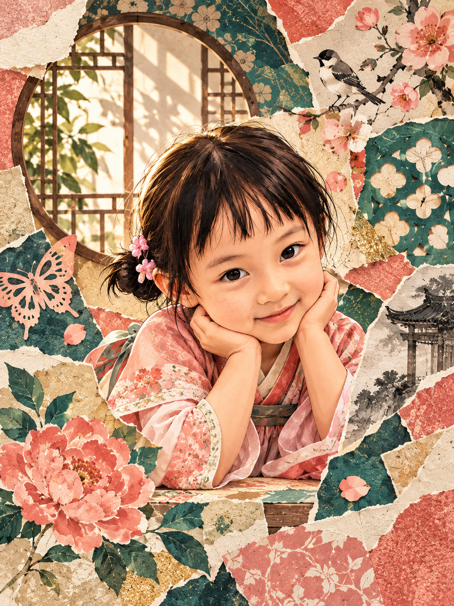

# jwan-culture-fragment-poster-engine

Jwan editorial engine for turning cultural fragments into coherent poster compositions.

Version: 1.0.0

## Features

- Distill people, places, objects, memories, and materials into one visual hierarchy.
- Combine photo, restrained illustration, typography, and negative space without random scrapbook clutter.
- Keep cultural references, anatomy, margins, and title legible.

## Case

## Usage

Use `$jwan-culture-fragment-poster-engine` with photos, cultural references, or scene notes. Add the intended place, story, or mood when known.

## Author / Contact

Created and maintained by Jwan.

- GitHub: https://github.com/gongjuan96-crypto
- Skill catalog: https://github.com/gongjuan96-crypto/jwan-skills
- WeChat: https://u.wechat.com/MJMydWwPFYpx-ZUAhUv6hj4?s=2

## Repository structure

- `SKILL.md` — complete Skill definition
- `TESTS.md` — regression and quality checks
- `CHANGELOG.md` — version history
- `examples/` — generated case images
- `examples/README.md` — case briefs and public-example notes
- `README.md` — usage and project notes
- `LICENSE` — MIT license

## License

Released under the MIT License. See `LICENSE`.
